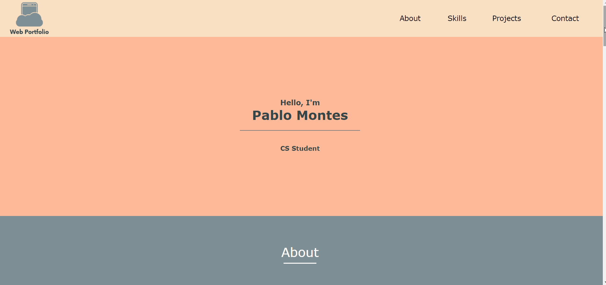

# HTML Portfolio Website

## Table of Contents
+ [About](#about)
+ [Demo Animated GIF](#demo_animated_gif)

## About 
This portfolio website was made from scratch using HTML, mainly table tags, and a tiny bit of help from CSS. The principal purpose was to strengthen my HTML abilities. In the process I learned a lot of basic HTML tricks, solved problems (mostly in the responsive aspect) and most importantly, had fun! The website is still very basic in my standards, but I am proud of it. Eventually, I will be updating this website with vital tools like JavaScript and React, to make it highly interactive, and create a rich user interface.

## Demo Animated GIF 

